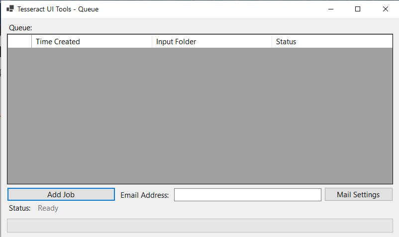
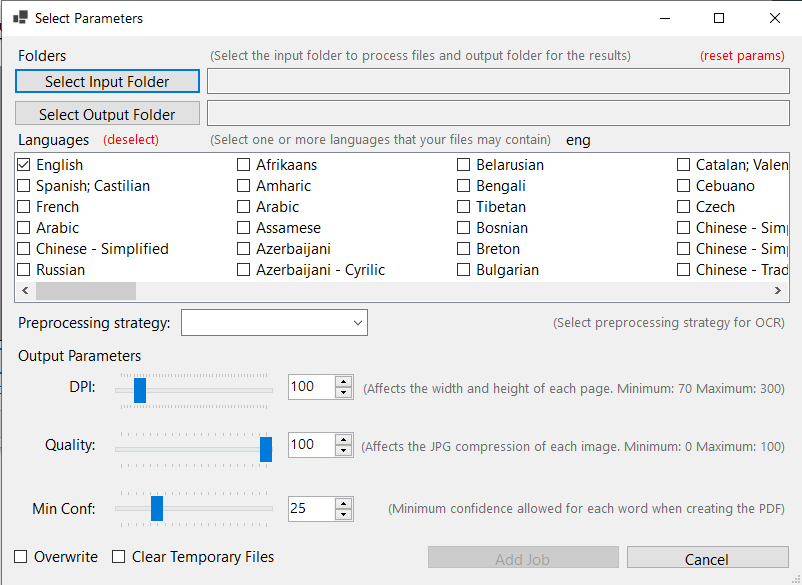
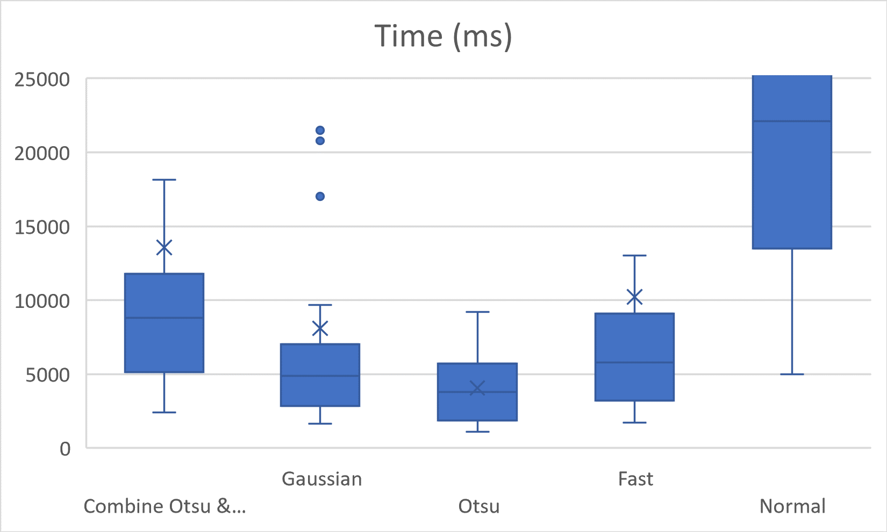
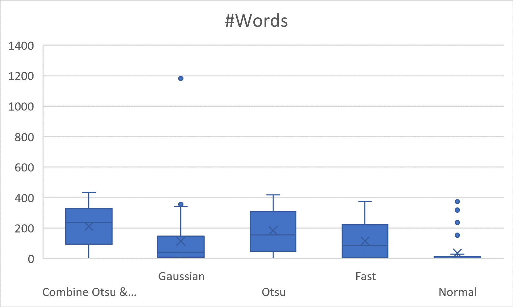
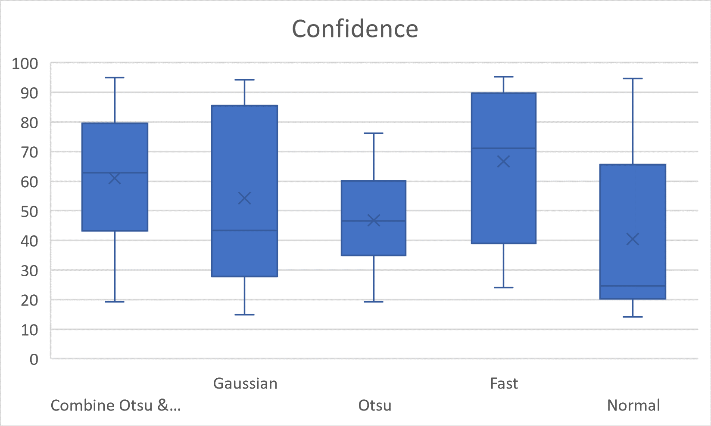
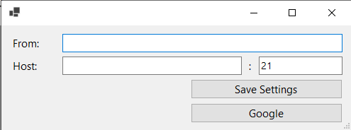

1. [About](#about)
2. [Installation](#installation)
3. [Usage](#usage)
4. [Mail Notification](#mail-notification)
5. [Troubleshooting & details](#troubleshooting--details)

## About

Tesseract UI Tools is an application that allows you to bulk apply the [Tesseract OCR](https://tesseract-ocr.github.io/) engine on multiple files to create PDFs with a searchable text layer.
This application is designed to make it easy to process a large number of files in a batch. It allows the queue of multiple jobs and processes them in the background.

A job consists of multiple parameters: input folder, output folder, languages to recognize, preprocessing strategy, DPI, quality and minimum confidence.

Currently, the application can handle the following formats: TIFF, TIF, JPEG, JPG and PDF.

## Installation

1. Download the latest [release](https://github.com/Tesseract-UI-Tools/Tesseract-UI-Tools/releases/).
2. Unzip the file.
3. Run the `Tesseract UI Tools.exe` file.
    - **Note:** During the first execution:
        1. .NET Desktop Runtime 6 might be automatically installed via a prompt popup.
        2. The language models will be downloaded, which might take some time.

## Usage



The main screen shows a table with the queue of jobs for this session. It also allows setting an email address to receive notifications by mail. See [Mail Notifications](#mail-notification) to set up it.

Each line of the table represents a job. It has a start time, the input folder and the status (which is either "Created", "Running" or "Finished").

Each job will populate the output folder with new PDF files generated by OCR'ing each file of the input folder. In case of any error a errors.txt file will be created with the filenames of files that could not be processed due to an error.

### Adding a job



After clicking on "Add Job" a new form will pop up. In this form you can set the parameters of the job:

 - Input Folder: this folder should contain one or more files. We don't look at subfolders.
 - Output Folder: this folder can contain files. It either replaces any PDFs with the same name as the files in the input folder or skips them depending on the Overwrite value.
 - Language(s): Specify what languages tesseract should use.
 - Preprocessing strategy: See [Preprocessing Strategies](#preprocessing-strategies)
 - DPI: Dots per inch, affects the width and height of the resulting images in the PDF. A value between 70 and 300.
 - Quality: Quality compression of the resulting images in the PDF. A value between 0 and 100.
 - Min Conf: Minimum tesseract confidence required. A value between 0 and 100.
 - Overwrite
 - Clear Temporary Files: Deletes any temporary files that are created.

After clicking on "Add Job" on this form it will close and the job is added to the queue. You can now add a different job. The last parameters used are saved during a session only.

#### Preprocessing strategies

The following table represents the steps of each strategy for preprocessing each image:

| Fast | Otsu | Gaussian | Fast & Otsu |
|------|------|----------|-------------|
| Reduce Image Size | Reduce Image Size | Reduce Image Size | Reduce Image Size |
| Tesseract | Median Blur | Median Blur | Median Blur & Tesseract (1) |
| | Otsu Threshold (Global) | Gaussian Threshold (Local) | Otsu Threshold (Global) |
| | Dilate | Dilate | Dilate |
| | Tesseract | Erode | Tesseract (2) |
| | | Tesseract | Merge Best Tesseract |

Each strategy was tested against the same input images. Follows the plots:

 - distribution of time, in milliseconds: 
 - distribution of the number of words: 
 - distribution of confidence: 

**Regarding time** Otsu was the fastest strategy, with a 4-second average. Followed by Gaussian with an 8-second average and Fast with a 10-second average.
This result is mainly caused because we are reducing to half the image before any other step.
Without reducing the image, the Plain strategy takes an average of 55 seconds. However, the number of words and confidence are not improved.

## Mail Notification



Tesseract UI Tools can send an email notifying you that a job has been completed.

The email consists of a report with two tables: the first table with the start time and the parameters for that job and the second table with information on the tesseract confidence and time for each file processed.

Also, this file is saved under the reports folder with the name `report-{DateTime.Now}.html`. See [Troubleshooting & details](#troubleshooting--details) to find this file.

### Sample Mail

| Parameter    | Value                 |
|--------------|-----------------------|
| Start Time   | 01/01/1970 00:00:00   |
| InputFolder  | C:\\...\\Test\\Input  |
| OutputFolder | C:\\...\\Test\\Output |
| Language     | eng                   |
| ...          | ...                   |

| Start Time | Filename | Pages | Time Elapsed | Words Threshold / Words Total | Confidence Mean Threshold / Confidence Mean Total |
|------------|----------|-------|---------------|-------------------------------|---------------------------------------------------|
| 01/01/1970 00:00:00 | File 1 | 5 | 36s | 957 / 1115 | 77.96429 / 68.227715 |
| 01/01/1970 00:00:36 | File 2 | ... | |  |  |
| ... | File 3 | | |  |  |

### Notes

The column "Words Threshold / Words Total" contains the number of words with confidence higher than the minimum confidence asked and the number of words in total.
Similarly, "Confidence Mean Threshold / Confidence Mean Total" contains the mean confidence for words higher than the minimum confidence and the mean of all word confidences.

### Configure Mail Server Settings

To receive this report by mail the user needs to have access to a server relay or a Google Account.

Using a server:

1. On the main screen, click "Mail Settings"
2. Fill in the Host, Port and From inputs.

Using a Google Account*:

1. On the main screen, click "Mail Settings"
2. Click on "Google"
3. Login with a google account that will be sending the email
4. Allow `Tesseract UI Tools` to send a mail with your account.

*Note: steps 1 and 2 must be done every time you open the application, steps 3 and 4 might not be required every time.

## Troubleshooting & details

 - The application saves information on two folders: `%AllUsersProfile%\Tesseract UI Tools\Tesseract UI Tools\1.0.0\` and `%APPDATA%\Tesseract UI Tools\Tesseract UI Tools\1.0.0\`.
 
 - The first folder contains the model information for the Tesseract OCR engine to run in any language.

 - The second folder contains two subfolders and a file `exceptions.log`:

```
Files\
Reports\
exceptions.log
```

   -  The exceptions.log contains a log of operations when the application runs and saves any errors that might occur.

 - Inside `Files\` for each file that runs it will create a folder with the same filename. Inside that folder for each page and for each job with different parameters it will create the files:

```
    {filename}\
        <page>.tiff
        <page.dpi.quality>.jpeg
        <page.strategy.lang>.tsv
```

 - Similarly, inside `Reports\` for each file and job it will create the files:

```
    <filename.lang.strategy>.html # file report
    report-{timestamp}.html # job report 
```

### Uninstalling

To completely uninstall the application delete the folder containing the executable created during the [installation](#installation) and delete the folders above.
